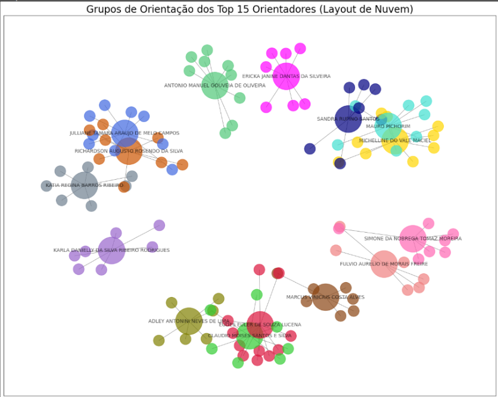

# Projeto — Grafo de Bolsistas de Iniciação Científica

## 👥 Equipe
- Jucinara Melo  
- Pablo Arthur 

---

## 🎯 Objetivo
Este projeto foi desenvolvido como **trabalho da disciplina "Algoritmos e Estruturas de Dados II"**.  

---

## 🖥️ Tecnologias e Linguagens Usadas

- **Python 3.10+** → linguagem principal usada no processamento e análise.  
- **Jupyter Notebook** → ambiente para execução interativa de código, análises e visualizações.  
- **Pandas** → manipulação e limpeza de dados.  
- **SQLite (sqlite3)** → banco de dados relacional usado para organizar tabelas fato e dimensão.  
- **NetworkX** → criação e análise de grafos.  
- **Matplotlib** → visualizações estáticas (grafo dos top orientadores).  
- **Gephi** → ferramenta de visualização e exploração interativa de grafos (`.gexf`).  

---

## 🛠️ Metodologia

### 🔹 1. Limpeza de dados (Python + pandas)
- Padronização de nomes de colunas (minúsculas, sem acentos).  
- Conversão de datas (`inicio`, `fim`) e campos numéricos (`ano`).  
- Normalização de textos (`discente`, `orientador`, `titulo`).  
- Filtragem apenas das bolsas **em andamento**.  

### 🔹 2. Modelagem em Banco de Dados (SQLite)
- Criação das tabelas **dimensão**:  
  - `discentes`  
  - `orientadores`  
  - `projetos`  
  - `unidades`  
  - `grupos`  
- Criação da tabela **fato**: `bolsas`.  
- Indexação para acelerar consultas.  

### 🔹 3. Exportação
- Geração de CSVs (`nodes_discentes.csv`, `nodes_orientadores.csv`, `nodes_projetos.csv`, `bolsas.csv`).  
- Arquivos usados para alimentar o grafo.  

### 🔹 4. Construção do Grafo (Python + NetworkX)
- Grafo **não direcionado e bipartido** (bolsista ↔ orientador).  
- Cada aresta representa uma relação de orientação em uma bolsa ativa.  
- Cálculo do **grau de cada nó**.  
- Identificação dos **Top 15 orientadores** mais conectados.  
- Construção de um **subgrafo** desses orientadores e seus bolsistas.  

### 🔹 5. Visualização (Python + Matplotlib / Gephi)
- Em **Matplotlib**:  
  - Grafo dos Top 15 orientadores com cores por grupo de orientação.  
  - Tamanhos de nó diferenciados (orientadores maiores, bolsistas menores).  
- Em **Gephi**:  
  - Importação do grafo em `.gexf`.  
  - Uso do layout **ForceAtlas2**.  
  - Detecção de **comunidades (modularidade)**.  
  - Visualização interativa dos clusters.  

---

## 📊 Resultados

-### 🔹 Visualização no Python (Matplotlib)  
O grafo gerado no Python mostra os **Top 15 orientadores** e seus bolsistas, evidenciando os grupos de pesquisa em diferentes cores:  

  

---

### 🔹 Visualização no Gephi (Layout Force Atlas)  
A versão interativa no **Gephi** permitiu uma exploração mais rica da rede, mostrando de forma clara os clusters de bolsistas organizados por orientador:  

  
6666666666666